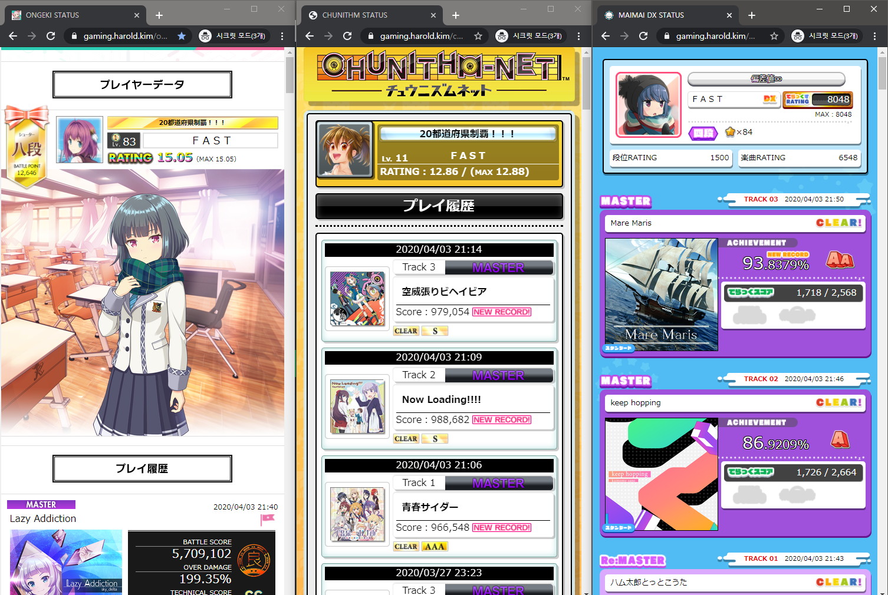

# GCMStat

SEGA Rhythm game status viewer by @stypr.

>  GCM: onGeki x Chunithm x Maimai

## Example

https://gaming.harold.kim/ongeki/

https://gaming.harold.kim/chunithm/

https://gaming.harold.kim/maimai/

## Environment

1. PHP 7+

2. nginx, Apache, ...

## Setup

1. Download this project to webroot (eg.) `/var/www/html/status/`)
2. Set cronjob (`crontab -e`)
   `*/30 * * * * php /var/www/html/status/check.php` will run the script every 30 minute
3. Set appropriate permission
   `chown -R www-data:www-data /var/www/html/status`
4. Change `__USERNAME__` and `__PASSWORD__` in `check.php`
5. Run `check.php` once. You should be able to see success message properly.
6. Done!

## Warning

1. You are entering your SEGA ID and password. Make sure you run this app on a secure environment.
2. The script runs every 30 minutes. You will be logged out every 30 minutes by the cronjob.

## Questions

> I am not able to get my maimai status. why?

Maimai DX has Japanese and International version. Both websites work differently. Feel free to contribute for Maimai International version.

